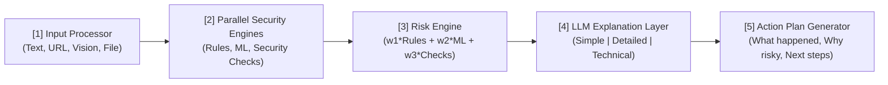
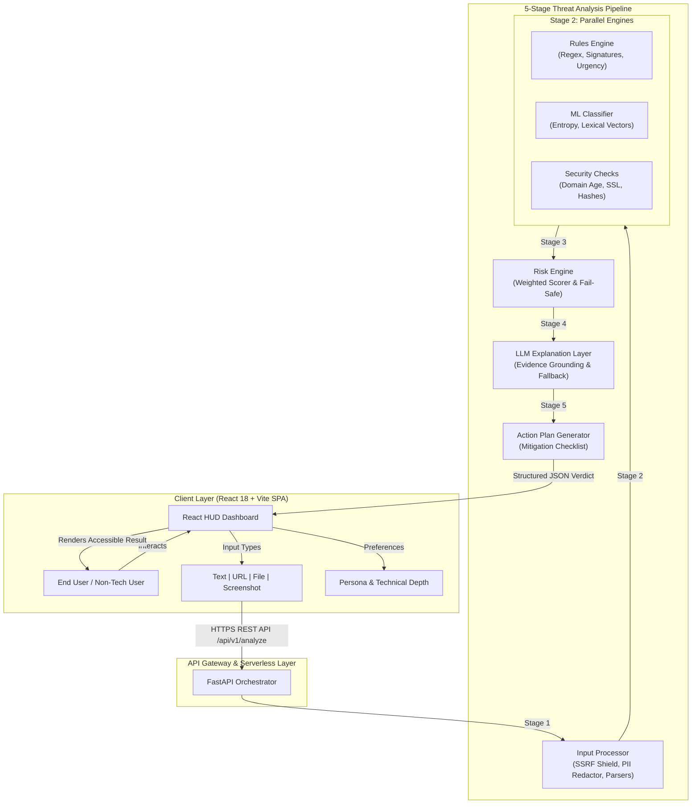
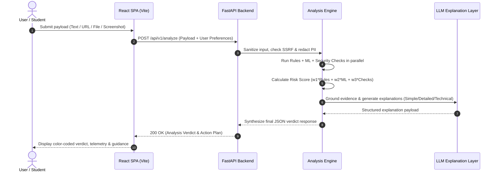

# CyberSafe 🛡️
> **An AI-Powered Cybersecurity Assistant for Everyone**  
> *"Think Before You Click • Upload • Analyze • Understand • Stay Safe"*

[]()
[]()
[]()
[]()
[]()
[]()

---

## 🌟 Vision & Mission
- **Our Vision:** *"A safer digital world for everyone."* To make cybersecurity simple, accessible, and actionable for every internet user.
- **Our Mission:** To empower individuals with easy-to-use cybersecurity tools that detect threats, explain risks in simple language, and guide them with clear actions.

Traditional security tools generate complex technical reports filled with cryptic telemetry that confuse everyday users. **CyberSafe** converts multi-engine threat signals into plain-language, actionable guidance tailored to the user's technical background.

---

## ⚡ Key Features

- **Multi-Modal Intake (4 Input Types):**
  - 📸 **Screenshot:** Upload screenshots of suspicious emails, popups, or messages.
  - 📝 **Text:** Directly paste suspicious message body, SMS, or email headers.
  - 🔗 **URL:** Submit suspicious websites for sandboxed domain and SSL analysis.
  - 📁 **File (Optional):** Upload documents (PDFs, scripts, executables) for static inspection.
- **User-Centric Customization:**
  - **Personas:** Student, Professional, Personal User.
  - **3 Explanation Tiers:** **Simple** (Zero jargon, analogies), **Detailed** (Balanced, threat mechanics), and **Technical** (Forensic indicators, IOCs, headers).
- **8 Core Threat Categories:**
  - 📧 Phishing (Emails, SMS)
  - 🐛 Malware (Attachments, Payloads)
  - 🌐 Malicious URLs (Typosquatting, Fake Domains)
  - 👥 Social Engineering (Scams, Impersonation)
  - 🔑 Account Security (Credentials, MFA)
  - 💻 Device Security (OS Configuration, Alerts)
  - 📡 Network Threats (MITM, Rogue Wi-Fi)
  - 🛡️ Web Security (SQLi, XSS, SSL/TLS)
- **Defensive Engineering & Safety:**
  - 🛡️ **SSRF Shield:** Pre-socket IP validation blocking RFC 1918, loopback, and cloud metadata (`169.254.169.254`).
  - 🔒 **PII Redaction:** Automatic client-side masking of credit cards, SSNs, and credentials before logging or LLM prompts.
  - ⚙️ **Deterministic Fail-Safe:** Automated boundary promotion protecting users from borderline false negatives.

---

## 🏛️ Platform & System Architecture

### 1. High-Level 5-Stage Pipeline Graph


### 2. End-to-End Component Architecture Blueprint


### 3. Request Execution Sequence Diagram


1. **Stage 1: Input Processor:** Normalizes raw inputs, scrubs PII, validates URLs against SSRF, and computes cryptographic hashes.
2. **Stage 2: Parallel Security Engines:** Concurrently executes:
   - **Rules Engine:** Regex heuristic and signature matcher for urgency, brand spoofing, and dangerous extensions.
   - **ML Classifier:** Extracts lexical entropy, domain age, and keyword vectors.
   - **Security Checks:** Validates SSL certificates, domain age, sender authenticity, and attachments.
3. **Stage 3: Risk Engine:** Computes calibrated risk score:
   $$\text{risk\_score} = (0.35 \times \text{rules}) + (0.35 \times \text{ml}) + (0.30 \times \text{checks})$$
4. **Stage 4: LLM Explanation Layer:** Generates 3 explanation tiers grounded strictly in verified evidence, with resilient fallback.
5. **Stage 5: Action Plan Generator:** Outputs an interactive remediation checklist.

---

## 🚀 Quickstart Guide

### Option 1: Docker Compose (Recommended)
Launch the full stack (FastAPI Backend + React Frontend + Nginx) with a single command:

```bash
# Clone the repository
git clone https://github.com/hypertonny/Cybersafe.git
cd Cybersafe

# Start services
docker compose up -d --build
```
Access the services at:
- **Web UI:** [http://localhost:3000](http://localhost:3000)
- **REST API:** [http://localhost:8000](http://localhost:8000)
- **Swagger Documentation:** [http://localhost:8000/docs](http://localhost:8000/docs)

---

### Option 2: Local Development

#### 1. Backend (FastAPI)
```bash
cd backend
python3 -m venv venv
source venv/bin/activate
pip install -r requirements.txt
uvicorn app.main:app --host 0.0.0.0 --port 8000 --reload
```

#### 2. Frontend (React + Vite)
```bash
cd frontend
npm install
npm run dev
```
The frontend will start at [http://localhost:5173](http://localhost:5173).

---

## 🧪 Testing & Quality Assurance

CyberSafe includes a comprehensive automated test suite covering unit and integration scenarios:

```bash
# Run all 25 unit and integration tests
pytest tests/ -v
```

```text
============================== 25 passed in 1.01s ==============================
tests/integration/test_api_endpoints.py::test_health_endpoint PASSED
tests/integration/test_api_endpoints.py::test_threat_categories_endpoint PASSED
tests/integration/test_api_endpoints.py::test_analyze_text_phishing PASSED
tests/integration/test_api_endpoints.py::test_analyze_benign_text PASSED
tests/integration/test_api_endpoints.py::test_preferences_save_and_get PASSED
tests/integration/test_error_handling.py::test_missing_analysis_returns_404 PASSED
tests/integration/test_error_handling.py::test_ssrf_blocked_returns_400 PASSED
tests/integration/test_error_handling.py::test_blurry_screenshot_flags_low_confidence PASSED
tests/unit/test_input_processor.py::test_text_parser_extraction PASSED
tests/unit/test_input_processor.py::test_url_parser PASSED
tests/unit/test_input_processor.py::test_file_parser_pdf PASSED
tests/unit/test_input_processor.py::test_screenshot_blurry_detection PASSED
tests/unit/test_ml_model.py::test_ml_model_high_risk_features PASSED
tests/unit/test_ml_model.py::test_ml_model_benign_features PASSED
tests/unit/test_risk_engine.py::test_risk_scoring_high_verdict PASSED
tests/unit/test_risk_engine.py::test_risk_scoring_ambiguity_fail_safe PASSED
tests/unit/test_risk_engine.py::test_risk_scoring_low_verdict PASSED
tests/unit/test_rules_engine.py::test_urgency_and_credential_detection PASSED
tests/unit/test_rules_engine.py::test_brand_spoofing_and_shortener PASSED
tests/unit/test_rules_engine.py::test_executable_file_detection PASSED
tests/unit/test_rules_engine.py::test_benign_content PASSED
tests/unit/test_ssrf_protection.py::test_ssrf_blocks_localhost PASSED
tests/unit/test_ssrf_protection.py::test_ssrf_blocks_loopback_ip PASSED
tests/unit/test_ssrf_protection.py::test_ssrf_blocks_metadata_ip PASSED
tests/unit/test_ssrf_protection.py::test_pii_redaction PASSED
```

---

## 📚 Complete Project Documentation

| Document | Description |
|---|---|
| 📑 [Consolidated Engineering Review](docs/CONSOLIDATED_ENGINEERING_REVIEW.md) | Executive summary, audit findings, gap analysis, and implementation roadmap. |
| 📋 [PRD Analysis & Enhancements](docs/PRD_ANALYSIS_AND_ENHANCEMENTS.md) | In-depth PRD audit, persona definitions, and requirement extensions. |
| 🏛️ [Technical Architecture](docs/ARCHITECTURE.md) | Pipeline stages, data flow, scoring mathematics, and fail-safe designs. |
| 🔌 [REST API Specification](docs/API_SPECIFICATION.md) | OpenAPI schemas, payload contracts, status codes, and curl examples. |
| 🛡️ [Security & Threat Model](docs/SECURITY_THREAT_MODEL.md) | STRIDE analysis, SSRF mitigation, prompt injection defense, and PII scrubbing. |
| 🎨 [UI/UX Design Specification](docs/UI_UX_DESIGN_SPECIFICATION.md) | Design tokens, layout hierarchy, and accessibility standards from canonical infographic. |
| 📊 [Requirements Traceability Matrix](docs/REQUIREMENTS_TRACEABILITY.md) | Bidirectional mapping between PRD, TRD, code modules, and test cases. |
| 💻 [Development & Setup Guide](docs/DEVELOPMENT_GUIDE.md) | Local environment configuration, dependencies, and formatting guidelines. |
| 🧪 [Testing & QA Strategy](docs/TESTING_STRATEGY.md) | Test pyramid, test fixture datasets, and CI quality gates. |
| 🚢 [Deployment & Operations Guide](docs/DEPLOYMENT_GUIDE.md) | Kubernetes manifests, Docker Compose, monitoring, and scaling. |
| 📐 [Architectural Decision Records (ADRs)](docs/adr/) | Key architectural decisions (Pipeline orchestration, AI fallback, SSRF, PII, Scoring). |

---

## 📄 License
CyberSafe is open-source software licensed under the [MIT License](LICENSE).
