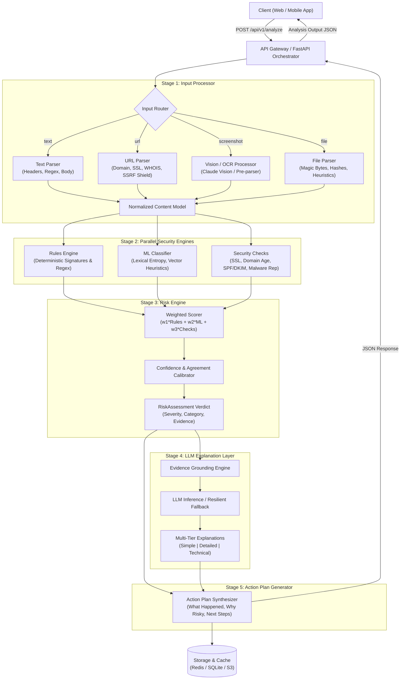

# CyberSafe — Technical Architecture & TRD Specification

**Document Version:** 1.1  
**Architecture Status:** Production Baseline  
**Companion Documents:** [PRD Analysis & Enhancements](file:///home/bnh/hypertonny/bnh/vijaybhoomi/cyber-sec/docs/PRD_ANALYSIS_AND_ENHANCEMENTS.md), [API Specification](file:///home/bnh/hypertonny/bnh/vijaybhoomi/cyber-sec/docs/API_SPECIFICATION.md), [Security & Threat Model](file:///home/bnh/hypertonny/bnh/vijaybhoomi/cyber-sec/docs/SECURITY_THREAT_MODEL.md)

---

## 1. System Overview & Architectural Topology

CyberSafe is engineered as a high-performance, asynchronous pipeline service designed to intake untrusted digital artifacts (text, URLs, files, images), extract structured telemetry, evaluate threats using parallel security engines, synthesize a multi-signal risk verdict, and render multi-tiered natural language explanations and remediation steps.

### 1.1 Architectural Blueprint

---

## 2. Pipeline Stage Specifications

### 2.1 Stage 1: Input Processor
The Input Processor is responsible for sanitization, de-obfuscation, metadata extraction, and producing a unified `InputProcessorOutput` schema.

- **Text Parser:**
  - Extracts email headers (From, Return-Path, Authentication-Results).
  - Identifies embedded URLs using RFC 3986 compliant regex.
  - Detects phone numbers, cryptocurrency addresses, and credential solicitation patterns.
  - Scrubs raw PII prior to external downstream logging.
- **URL Parser:**
  - **SSRF Defense:** Evaluates the resolved IP address before socket connection. Disallows loopback (`127.0.0.0/8`), private RFC 1918 subnets (`10.0.0.0/8`, `172.16.0.0/12`, `192.168.0.0/16`), link-local AWS metadata (`169.254.169.254`), and IPv6 equivalents.
  - Normalizes URLs (decodes percent-encoding, punycode conversion).
  - Inspects SSL/TLS certificate validity (expiry, issuer, hostname match).
  - Retrieves domain registration date via WHOIS to compute `domain_age_days`.
- **Vision / OCR Processor:**
  - Emits image dimensions, mime-type verification, and visual feature extraction.
  - Invokes multimodal vision model (or local OCR fallbacks) to transcribe all text while detecting visual red flags (e.g. fake login modals, blurred logos).
  - Implements blurry / unreadable detection (returning `low_confidence = true` if text entropy < threshold).
- **File Parser:**
  - Computes cryptographic digests: MD5, SHA-1, SHA-256.
  - Verifies true MIME type using magic byte inspection (preventing `.exe` disguised as `.pdf`).
  - Flags high-risk executable extensions (`.exe`, `.bat`, `.vbs`, `.ps1`, `.scr`, `.jar`).

### 2.2 Stage 2: Security Engines (Parallel Execution)
The three security engines execute concurrently via Python `asyncio.gather()` to minimize latency:

1. **Rules Engine (Deterministic Matcher):**
   - Matches known signature patterns with calibrated severity weights:
     - Urgency phrases: *"immediate action required"*, *"account will be terminated in 24 hours"* (weight: 0.25).
     - Credential/OTP traps: *"enter password"*, *"verify your OTP"* (weight: 0.35).
     - Brand impersonation / spoofing: *"Paypa1"*, *"Micros0ft"*, *"Netflx"* (weight: 0.40).
     - Shortened URLs: `bit.ly`, `tinyurl.com`, `t.co`, `ow.ly` (weight: 0.20).
     - Suspicious file characteristics: macros in Office documents, executable binaries (weight: 0.50).
2. **Machine Learning Classifier:**
   - Evaluates a lightweight feature vector:
     - Lexical URL features: URL length, character entropy, count of hyphens/subdomains, presence of IP address in host.
     - Domain features: Domain age < 30 days (high risk), absent WHOIS privacy.
     - Textual features: Frequency of fear-based or urgent tokens.
   - Generates `{ label: str, probability: float }`.
3. **Security Checks:**
   - **Domain Reputation Check:** Cross-references known blocklists and suspicious TLD patterns (`.xyz`, `.top`, `.tk`, `.ru`).
   - **SSL Certificate Check:** Validates SSL validity, self-signed certificates, or SSL expiring in < 7 days.
   - **Sender Authenticity Check:** Inspects SPF, DKIM, DMARC signals if headers are provided.
   - **Attachment Risk Check:** Evaluates executable hashes and dangerous file mime types.

### 2.3 Stage 3: Risk Engine & Scoring Formula
The Risk Engine synthesizes the telemetry from Stage 2 into a single unified verdict.

#### Scoring Formula:
$$\text{risk\_score} = (w_1 \times \text{rules\_score}) + (w_2 \times \text{ml\_probability}) + (w_3 \times \text{failed\_checks\_ratio})$$

- **Configurable Weights:**
  - $w_1 = 0.35$ (Deterministic Rules)
  - $w_2 = 0.35$ (ML Classifier)
  - $w_3 = 0.30$ (Security Checks Ratio)
  - Constraint: $w_1 + w_2 + w_3 = 1.0$

#### Severity Thresholding:
- **High Risk:** $\text{risk\_score} \ge 0.75$
- **Medium Risk:** $0.40 \le \text{risk\_score} < 0.75$
- **Low Risk:** $\text{risk\_score} < 0.40$
- **Fail-Safe Ambiguity Rule:** If $\text{risk\_score}$ falls within $\pm 0.03$ of a threshold boundary (e.g., $0.73$ or $0.38$), the system defaults to the higher severity category to protect the user.

#### Calibrated Confidence Score:
Confidence is determined by the mutual agreement between the Rules Engine and the ML Classifier:
$$\text{confidence} = \begin{cases} 
\min(0.99, 0.70 + 0.25 \times \text{agreement}) & \text{if Rules and ML agree on category} \\
\max(0.50, 0.75 - 0.20 \times |\text{rules\_score} - \text{ml\_probability}|) & \text{if disagreement occurs}
\end{cases}$$

### 2.4 Stage 4: LLM Explanation Layer & Grounding
The LLM layer translates technical telemetry into accessible insights.
- **Strict Evidence Grounding:** The prompt template feeds only the structured `evidence_collection` and `signals` produced by Stage 3. The LLM is prohibited from inventing facts or overriding the severity classification.
- **Three Simultaneous Tiers:**
  - `simple`: 6th-grade reading level, conversational, zero security jargon.
  - `detailed`: Balanced overview explaining attack vectors and real-world implications.
  - `technical`: Forensic breakdown citing IOCs, protocol anomalies, and mitigation specifics.
- **Resilient Fallback Mode:** If the LLM API is unavailable, throttled, or times out (> 3 seconds), an internal deterministic templating engine generates the three explanation tiers directly from the `evidence_collection`, setting `is_degraded = true` and `reduced_confidence = true`.

### 2.5 Stage 5: Action Plan Generator
Synthesizes a structured 3-part response:
1. `what_happened`: Plain summary of the event (e.g., *"You received an email claiming your bank account was locked."*).
2. `why_risky`: Clear explanation of potential loss (e.g., *"The link directs to an unauthorized domain that steals login credentials and multi-factor codes."*).
3. `what_to_do`: Prioritized, numbered, actionable instructions tailored to the user's situation.

---

## 3. Resilience & Error Handling Architecture

| Failure Mode | Detection Condition | Automated Recovery / Degradation Strategy | Response Status |
|---|---|---|---|
| **Unreadable Image** | OCR extracts < 3 tokens or entropy < 1.2 | Set `low_confidence = true`. Prompt user to re-upload clear image or paste text directly. | HTTP 200 with warning |
| **Unsupported File** | Magic bytes do not match allowed whitelist | Immediate rejection with explicit supported extensions list (`.pdf`, `.png`, `.jpg`, `.txt`, `.eml`, `.exe`). | HTTP 422 Unprocessable |
| **Unreachable URL** | DNS resolution failure or network timeout | Fall back to lexical/domain-only analysis. Flag `partial_analysis = true`. | HTTP 200 with partial flag |
| **SSRF Attempt** | Target IP resolves to RFC 1918 / Loopback | Block network egress immediately. Log security audit event. | HTTP 400 Bad Request |
| **LLM Service Timeout** | Claude/Gemini API call > 3.0s | Retry once; if second attempt fails, generate templated explanation. Flag `reduced_confidence = true`. | HTTP 200 (Degraded Mode) |
| **Ambiguous Verdict** | Score between 0.72 - 0.75 or 0.37 - 0.40 | Fail-safe: promote to higher risk category (Medium -> High or Low -> Medium). | HTTP 200 with fail-safe note |

---

## 4. Non-Functional Performance Budget

- **End-to-End Latency Target:** Under 8 seconds at p99, Under 3.5 seconds at p50.
- **Availability SLA:** 99.5% uptime.
- **Stateless Scaling:** Backend workers run as stateless Docker containers coordinated via Uvicorn/FastAPI.
- **Memory Footprint:** Max 256MB RAM per worker process during normal operations.
