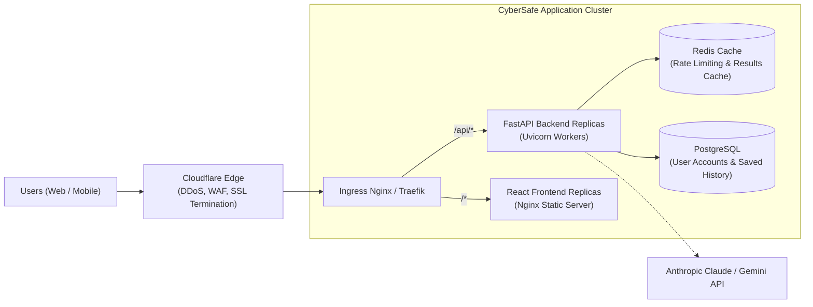

# CyberSafe — Deployment & Operations Guide

**Target Environments:** Local Docker Compose, Cloud Virtual Machines, Managed Kubernetes (EKS / GKE)  
**Reliability Target:** 99.5% Uptime, Sub-8s p99 Latency

---

## 1. Deployment Topology

CyberSafe is packaged as containerized microservices deployed behind a reverse proxy / API Gateway:



---

## 2. Docker Compose Quickstart (Single-Host Production / Staging)

The root of the repository provides a complete `docker-compose.yml` orchestrating both the frontend and backend services:

```bash
# Clone the repository
git clone https://github.com/hypertonny/Cybersafe.git
cd Cybersafe

# Copy and customize environment variables
cp backend/.env.example backend/.env

# Build and launch all containers in detached mode
docker compose up -d --build

# Verify container health
docker compose ps
```

Services are mapped to:
- **Frontend Web UI:** `http://localhost:3000` (or `http://localhost:5173`)
- **Backend REST API:** `http://localhost:8000`
- **Interactive Documentation:** `http://localhost:8000/docs`

---

## 3. Kubernetes Deployment Manifests

For resilient, auto-scaling cloud deployments:

### 3.1 Backend Deployment & Horizontal Pod Autoscaler (HPA)
```yaml
apiVersion: apps/v1
kind: Deployment
metadata:
  name: cybersafe-backend
  labels:
    app: cybersafe-backend
spec:
  replicas: 3
  selector:
    matchLabels:
      app: cybersafe-backend
  template:
    metadata:
      labels:
        app: cybersafe-backend
    spec:
      containers:
        - name: backend
          image: cybersafe-backend:v1.0.0
          ports:
            - containerPort: 8000
          resources:
            requests:
              cpu: "250m"
              memory: "256Mi"
            limits:
              cpu: "1000m"
              memory: "512Mi"
          livenessProbe:
            httpGet:
              path: /api/v1/health
              port: 8000
            initialDelaySeconds: 10
            periodSeconds: 15
          readinessProbe:
            httpGet:
              path: /api/v1/health
              port: 8000
            initialDelaySeconds: 5
            periodSeconds: 5
          envFrom:
            - configMapRef:
                name: cybersafe-config
            - secretRef:
                name: cybersafe-secrets
---
apiVersion: autoscaling/v2
kind: HorizontalPodAutoscaler
metadata:
  name: cybersafe-backend-hpa
spec:
  scaleTargetRef:
    apiVersion: apps/v1
    kind: Deployment
    name: cybersafe-backend
  minReplicas: 3
  maxReplicas: 20
  metrics:
    - type: Resource
      resource:
        name: cpu
        target:
          type: Utilization
          averageUtilization: 70
```

---

## 4. Operational Observability & Logging

1. **Structured JSON Logging:**
   All logs emit machine-readable JSON containing `timestamp`, `log_level`, `request_id`, `input_type`, `risk_verdict`, and `latency_ms`.
2. **Prometheus Metrics:**
   - `cybersafe_analysis_requests_total{input_type, status}`
   - `cybersafe_analysis_duration_seconds{stage}`
   - `cybersafe_threat_detections_total{category, severity}`
   - `cybersafe_ssrf_blocked_total`
   - `cybersafe_llm_degraded_total`
3. **Alerting Thresholds:**
   - Error rate > 1% over 5 minutes.
   - p95 latency > 7.0 seconds over 5 minutes.
   - LLM fallback degradation rate > 10% over 10 minutes.

---

## 5. Security Hardening & Zero Trust Configuration

- **Read-Only Root Filesystems:** Containers execute with read-only root filesystems and write exclusively to transient in-memory tmpfs (`/tmp`).
- **Non-Root Execution:** Worker processes run as non-privileged user `uid: 10001` (`appuser`).
- **Network Policies:** Kubernetes network policies restrict backend egress strictly to necessary external DNS, HTTPS ports, and internal Redis/DB clusters.
