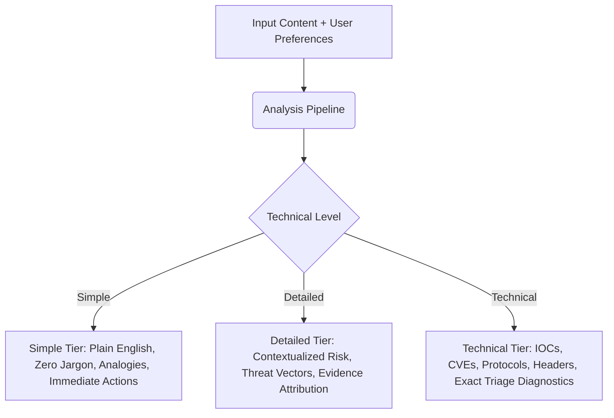

# CyberSafe — Product Requirements Document (PRD) Analysis & Enhancements

**Document Version:** 1.1  
**Original Status:** Draft (v1.0)  
**Enhanced Status:** Approved Engineering Baseline  
**Target Product:** CyberSafe — An AI-Powered Cybersecurity Assistant for Everyone  

---

## 1. Executive Summary & Assessment of Original PRD

The original CyberSafe PRD (v1.0) defines a compelling product vision: *"To empower individuals with easy-to-use cybersecurity tools that detect threats, explain risks in simple language, and guide them with clear actions."*

The core four-step workflow (**Upload → Analyze → Understand → Stay Safe**) addresses a critical market gap: traditional cybersecurity tooling (e.g., VirusTotal, URLScan, SIEM alerts) generates arcane technical telemetry that paralyzes non-technical consumers, students, and small business owners. CyberSafe's premise of coupling heuristic security engines with an LLM explanation layer calibrated to the user's technical background is strategically sound.

However, a rigorous review of PRD v1.0 reveals several critical ambiguities, missing functional requirements, and unaddressed edge cases that create engineering risk if left unresolved.

---

## 2. Detailed Findings: Gaps, Ambiguities & Inconsistencies

### 2.1 Missing Functional Requirements in PRD v1.0
1. **Authentication & User Identity:**
   - *PRD Omission:* The PRD lists "Who are you?" as a preference dropdown, but does not define whether users must create an account, log in, or whether guest/anonymous usage is permitted.
   - *TRD Friction:* TRD Section 9 states: *"Access to stored analysis results is authenticated and scoped to the submitting user."* Without an authentication specification in the PRD, this requirement cannot be implemented consistently.
   - *Enhancement:* CyberSafe must support **Session-based Guest Mode** (transient analysis, no stored PII, results accessible via temporary UUID token for 1 hour) alongside **Authenticated User Accounts** (saved submission history, persistent preference profiles).

2. **File Size and Payload Limits:**
   - *PRD Omission:* Section 2 specifies "Screenshot" and "File (Optional)" input types, but provides no file size limits, accepted MIME types, or compression constraints.
   - *Engineering Hazard:* Users uploading 50MB PDFs or multi-gigabyte ISO disk images would crash backend memory and exceed LLM context windows.
   - *Enhancement:*
     - Screenshots: Max 10MB; Formats: `image/png`, `image/jpeg`, `image/webp`.
     - Files: Max 15MB; Formats: `application/pdf`, `application/vnd.openxmlformats-officedocument.*`, plain text scripts (`.py`, `.sh`, `.ps1`), and executable binaries (`.exe`, `.bin`).

3. **Multi-language and Regional Localization:**
   - *PRD Omission:* The PRD implicitly assumes English language submissions and explanations.
   - *Threat Landscape Reality:* Regional phishing campaigns (e.g., Hindi SMS scams, Spanish banking malware, German invoices) represent a massive fraction of real-world threats.
   - *Enhancement:* The Input Processor must detect input language, and the LLM Explanation Layer must support generating responses in the user's detected or preferred language while preserving canonical technical security terms.

4. **Interactive Action Plan & Remediation Tracking:**
   - *PRD Omission:* Section 4.5 and 5 present an Action Plan ("What should you do?"), but only as static text bullets.
   - *Enhancement:* Convert the Action Plan into an interactive checklist allowing users to check off completed remediation steps (e.g., *"Password changed"*, *"Device disconnected"*), with a progress tracker and exportable incident summary.

5. **Rate Limiting & Abuse Prevention:**
   - *PRD Omission:* No rate limits are specified. Because CyberSafe integrates generative AI inference (Claude vision/text API) and security lookups, unmetered public access exposes the service to financial denial-of-wallet and automated scraping attacks.
   - *Enhancement:* Tiered rate limits: Guest (5 requests/hour per IP), Authenticated User (30 requests/hour), Business/Pro (unlimited/custom quota).

---

## 3. Threat Category Coverage & Mapping

The PRD establishes 8 threat categories in Section 6. The table below formalizes each category, its real-world detection vectors, and its risk indicators:

| # | Threat Category | Primary Target Surface | Input Types | Key Detection Indicators |
|---|---|---|---|---|
| 1 | **Phishing** | Emails, SMS (Smishing), Social DMs | Screenshot, Text, URL | Urgency triggers, spoofed sender domains, lookalike domains, requests for credentials or OTPs. |
| 2 | **Malware** | File downloads, Email attachments | File, Screenshot, URL | Suspicious file extensions, double extensions (e.g., `.pdf.exe`), anomalous entropy, high macro risks. |
| 3 | **Malicious URLs** | Web links, QR codes, Redirects | URL, Screenshot, Text | Typosquatting, newly registered domains (<30 days), missing/invalid SSL, punycode spoofing, IP-based URLs. |
| 4 | **Social Engineering** | Impersonation, Romance, Fake Authority | Text, Screenshot | Fabricated authority (IRS, police, CEO), artificial urgency, requests for gift cards or wire transfers. |
| 5 | **Account Security** | Passwords, 2FA/MFA, Session tokens | Text, Screenshot | Compromised credential formats, credential stuffing alerts, fake login portals, SIM swap notifications. |
| 6 | **Device Security** | OS configuration, App permissions | Screenshot, Text | Rogue configuration profiles, fake virus warnings, browser notification abuse, malicious APK/profile links. |
| 7 | **Network Threats** | Wi-Fi, DNS, Port Scans, MITM | Text, URL, File | Unencrypted captive portals, rogue DNS redirects, suspicious open proxy IPs, SSL certificate downgrade. |
| 8 | **Web Security** | Web apps, Form inputs, Endpoints | URL, Text | SQL injection strings, reflected XSS payloads, broken SSL/TLS ciphers, insecure cookie policies. |

---

## 4. Enhanced User Personas & Preference Specifications

The PRD defines three user types and three technical explanation levels. The matrix below defines how the LLM Explanation Layer adapts its vocabulary, depth, and tone:

### 4.1 Explanation Style Guidelines
1. **Simple (Non-Technical):**
   - **Target Audience:** General public, elderly family members, young students.
   - **Tone:** Calm, clear, protective, free of intimidation.
   - **Rules:** No acronyms (e.g., use *"fake website"* instead of *"punycode DNS homograph"*). Use real-world analogies (e.g., *"like someone showing a fake badge at your front door"*). Focus heavily on the concrete *"What should you do?"* checklist.
2. **Detailed (Balanced):**
   - **Target Audience:** IT-aware office workers, managers, small business owners.
   - **Tone:** Professional, objective, analytical.
   - **Rules:** Clearly cite what specific indicators caused the alert. Explain why the mechanism is dangerous to business or personal accounts.
3. **Technical (Advanced):**
   - **Target Audience:** Software engineers, cybersecurity students, SecOps analysts.
   - **Tone:** Precise, forensic, evidentiary.
   - **Rules:** Enumerate observed Indicators of Compromise (IOCs), SSL certificate issuer details, WHOIS registrar creation dates, lexical entropy metrics, regex rule identifiers, and MITRE ATT&CK technique IDs where applicable.

---

## 5. Requirements Traceability Matrix (PRD Requirements)

| Req ID | PRD Section | Requirement Description | Priority | Verification Method |
|---|---|---|---|---|
| **REQ-PRD-01** | Sec 2 | Support 4 distinct input types: Screenshot, Text, URL, File | Critical | Automated API & UI Integration Tests |
| **REQ-PRD-02** | Sec 3 | Support 3 user personas (Student, Professional, Personal User) | High | UI Form & Storage Validation |
| **REQ-PRD-03** | Sec 3 | Support 3 explanation tiers (Simple, Detailed, Technical) generated per request | Critical | Unit test verifying all 3 tiers in response payload |
| **REQ-PRD-04** | Sec 3 | Support optional focus areas (Emails, Websites, Accounts, Devices, Networks, Everything) | Medium | Backend preference filtering |
| **REQ-PRD-05** | Sec 4 | Five-stage processing pipeline (Input -> Security -> Risk -> LLM -> Action Plan) | Critical | End-to-end pipeline execution test |
| **REQ-PRD-06** | Sec 5 | Output specification matching Risk Level, Confidence, Category, Why Suspicious, Impact, Action Plan | Critical | Schema contract validation |
| **REQ-PRD-07** | Sec 6 | Coverage for all 8 defined threat categories | High | Category classifier test fixtures |
| **REQ-PRD-08** | Sec 7 | Zero technical jargon in Simple explanation style | High | Linter / Vocabulary audit heuristic |

---

## 6. Success Metrics & KPIs

To measure the product's effectiveness, the following KPIs are mandated:
- **Time to Actionable Advice (Latency):** 95th percentile analysis latency ≤ 6.0 seconds (well under the 8.0s TRD threshold).
- **Explanation Comprehension Rate:** ≥ 92% user agreement that the Simple tier is easily understandable without assistance.
- **Action Completion Rate:** ≥ 75% of users execute at least the top 2 steps of the Action Plan.
- **False Positive Rate:** < 3.5% on benign business communication samples.
- **Availability:** 99.9% uptime for core analysis orchestration.
