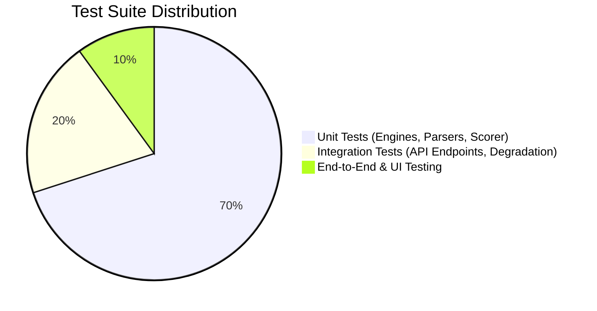

# CyberSafe — Testing & QA Strategy

**Document Version:** 1.0  
**Target Coverage:** ≥ 90% across core engines and API routing  
**Test Pyramid:** Unit (70%) → Integration (20%) → End-to-End UI (10%)

---

## 1. Testing Philosophy & Test Pyramid

CyberSafe evaluates potentially dangerous inputs and produces actionable advice for end users. Testing must guarantee:
1. **Mathematical Accuracy:** The risk scoring formula ($w_1 \cdot \text{rules} + w_2 \cdot \text{ml} + w_3 \cdot \text{checks}$) must compute deterministically and respect configured thresholds.
2. **Defensive Rigor:** SSRF defenses, PII scrubbers, and regex timeouts must never fail open under malicious or malformed input.
3. **Contract Adherence:** API inputs and outputs must match the PRD v1.0 and TRD v1.0 specifications exactly.
4. **Graceful Degradation:** When third-party LLMs or external networks are unavailable, the system must degrade safely rather than returning unhandled 500 errors.



---

## 2. Test Suites Organization

### 2.1 Unit Test Coverage (`tests/unit/`)
- `test_input_processor.py`:
  - Validates Text Parser extraction of URLs, emails, and urgency keywords.
  - Validates URL Parser normalization, domain breakdown, and SSL checks.
  - Validates File Parser SHA-256 calculation and dangerous extension flagging.
  - Validates Image OCR fallback and blurry image detection (`low_confidence`).
- `test_rules_engine.py`:
  - Urgency triggers (`immediate action`, `24 hours`).
  - Credential harvesting patterns (`verify your password`, `enter OTP`).
  - Brand spoofing variations (`Paypa1`, `Netflx`).
  - URL shortener detection (`bit.ly`, `tinyurl`).
- `test_ml_model.py`:
  - Lexical feature extraction (URL length, character entropy, hyphens).
  - Multi-class classification probability distribution.
- `test_risk_engine.py`:
  - High risk threshold test ($\ge 0.75$).
  - Medium risk threshold test ($0.40 \le x < 0.75$).
  - Low risk threshold test ($< 0.40$).
  - Fail-safe caution boundary promotion test ($\pm 0.03$).
  - Agreement factor confidence calculation.
- `test_ssrf_protection.py`:
  - Loopback blocking (`127.0.0.1`, `localhost`).
  - RFC 1918 private IP blocking (`10.0.0.1`, `192.168.1.1`).
  - Cloud metadata blocking (`169.254.169.254`).
  - IPv6 local address blocking (`::1`).

### 2.2 Integration Test Coverage (`tests/integration/`)
- `test_api_endpoints.py`:
  - `POST /api/v1/analyze` for all 4 input types: `text`, `url`, `file`, `screenshot`.
  - Preference passing: `who_are_you`, `technical_level`, `focus_area`.
  - Explanation tier generation (verifying `simple`, `detailed`, and `technical` are all present).
  - `GET /api/v1/analyze/{id}` retrieval of saved record.
  - `GET /api/v1/threat-categories` returns all 8 categories.
  - `GET /api/v1/health` returns healthy status.
- `test_error_handling.py`:
  - Blurry screenshot handling (`low_confidence = true`).
  - Unsupported file types (`422 Unprocessable`).
  - SSRF attempts (`400 Bad Request`).
  - External LLM degradation fallback mode (`is_degraded = true`).

---

## 3. Test Fixture Datasets

To ensure realistic benchmarking, CyberSafe uses curated test vectors representing each of the 8 threat categories:

| Threat Category | Test Input Vector | Expected Verdict | Expected Category |
|---|---|---|---|
| **Phishing** | *"Urgent: Your PayPal account has been suspended! Click http://paypa1-verify.xyz/auth immediately to prevent permanent account termination."* | High Risk (≥ 0.85) | `phishing` |
| **Malware** | File with payload `.invoice_march.pdf.exe` containing executable PE header. | High Risk (≥ 0.90) | `malware` |
| **Malicious URL** | `http://192.168.0.1.attacker-site.biz/login?token=abc` with 3-day old domain and self-signed SSL. | High Risk (≥ 0.80) | `malicious_url` |
| **Social Engineering** | *"Hi Mom, I broke my phone. Please send $500 to this new WhatsApp number urgently."* | Medium / High (≥ 0.70) | `social_engineering` |
| **Benign Sample** | *"Hi team, here is the updated meeting agenda for Thursday's architecture review. See https://github.com/hypertonny/Cybersafe"* | Low Risk (< 0.20) | `phishing` (benign) |

---

## 4. Continuous Integration & Quality Gates

In GitHub Actions CI:
```yaml
# CI Workflow: .github/workflows/ci.yml
name: CyberSafe CI
on: [push, pull_request]
jobs:
  test:
    runs-on: ubuntu-latest
    steps:
      - uses: actions/checkout@v4
      - uses: actions/setup-python@v5
        with:
          python-version: '3.11'
      - run: pip install -r backend/requirements.txt
      - run: pytest tests/ --cov=backend/app --cov-fail-under=85
      - uses: actions/setup-node@v4
        with:
          node-version: '20'
      - run: cd frontend && npm ci && npm run build
```
Quality gate mandates:
- Zero test failures.
- Minimum 85% branch and statement coverage.
- Linter checks clean without critical warnings.
