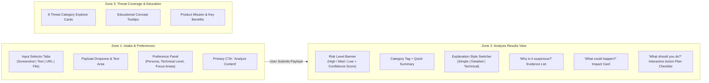

# CyberSafe — UI/UX Design Specification & Visual Audit

**Document Version:** 1.0  
**Design Reference:** Canonical CyberSafe Infographic & Architecture Poster (`CyberSafe: Think Before You Click`)  
**Companion Documents:** [PRD Analysis](file:///home/bnh/hypertonny/bnh/vijaybhoomi/cyber-sec/docs/PRD_ANALYSIS_AND_ENHANCEMENTS.md), [Architecture](file:///home/bnh/hypertonny/bnh/vijaybhoomi/cyber-sec/docs/ARCHITECTURE.md)

---

## 1. Visual Design Philosophy & Design System

The CyberSafe infographic establishes a welcoming, clear, and reassuring visual language tailored to non-technical users who are often frightened or anxious when encountering suspected cybersecurity threats.

### 1.1 Color Palette & Visual Semantics

| Semantic Purpose | Token Name | Hex Code | Visual Application |
|---|---|---|---|
| **Brand Primary** | `--color-brand` | `#1A56DB` / `#1E40AF` | Navigation, headers, primary action buttons, Shield logo |
| **Brand Accent** | `--color-accent` | `#3B82F6` | Active state borders, focus rings, interactive toggles |
| **High Risk (Critical)** | `--color-risk-high` | `#DC2626` / `#EF4444` | High risk banner, warning triangle, dangerous indicators |
| **Medium Risk (Warning)**| `--color-risk-med` | `#D97706` / `#F59E0B` | Medium risk banner, warning callouts, "What could happen?" |
| **Low Risk (Safe)** | `--color-risk-low` | `#059669` / `#10B981` | Safe badge, "What should you do?" checklist, success confirmations |
| **Simple Tier** | `--color-tier-simple` | `#10B981` | Simple explanation pill/tab, non-technical badge |
| **Detailed Tier** | `--color-tier-detailed` | `#2563EB` | Detailed explanation pill/tab, balanced analysis badge |
| **Technical Tier** | `--color-tier-technical`| `#7C3AED` | Technical explanation pill/tab, advanced diagnostics badge |
| **Neutral Canvas** | `--color-bg-main` | `#F8FAFC` | Page background, calm off-white / light slate |
| **Card Surface** | `--color-surface` | `#FFFFFF` | Elevated content containers, input cards, modal surfaces |
| **Text Primary** | `--color-text-primary`| `#0F172A` | Primary typography, headers, card titles |
| **Text Secondary** | `--color-text-muted` | `#64748B` | Subtext, helper captions, input placeholders |

---

## 2. Layout Structure & Information Architecture

The UI is structured into three primary interactive columns/zones:

---

## 3. UI Component Specifications

### 3.1 Input Module (`Zone 1`)
- **Screenshot Tab:** Drag-and-drop file uploader accepting PNG, JPG, WebP with thumbnail preview and image resolution check.
- **Text Tab:** Auto-expanding text area with character counter and quick "Paste from Clipboard" button.
- **URL Tab:** Clean input field with protocol prefill (`https://`), auto-cleansing of tracking parameters, and instant domain preview.
- **File Tab:** Sandboxed file uploader accepting PDF, DOCX, scripts, and executables with file size indicator (max 15MB).

### 3.2 User Preferences Component
- **Who are you?:** Accessible dropdown selector (`Student`, `Professional`, `Personal User`).
- **Technical Level Toggle:** Three-way segmented control button group (`Simple (Non-technical)`, `Detailed (Balanced)`, `Technical (Advanced)`).
- **Focus Area Pills:** Multi-select interactive filter chips (`Emails & Messages`, `Websites & Links`, `Account Security`, `Device Security`, `Network Security`, `Everything`).

### 3.3 Analysis Output Component (`Zone 2`)
- **Risk Verdict Header:**
  - Dynamic severity badge with pulsing status icon.
  - Large risk level title (`HIGH RISK`, `MEDIUM RISK`, `LOW RISK`).
  - Circular or bar confidence meter displaying exact percentage (e.g. `Confidence: 94%`).
  - Threat category badge with icon (e.g. `Phishing / Social Engineering`).
- **Explanation Tabs:**
  - Segmented tab bar allowing immediate switching between `Simple`, `Detailed`, and `Technical` explanations without re-running the backend analysis.
- **"Why is it suspicious?":**
  - Crisp, scannable bullet points highlighting deterministic indicators (urgent tone, sender mismatch, suspicious domain age).
- **"What could happen?":**
  - Warm amber callout box clearly explaining potential consequences (identity theft, financial fraud, malware infection).
- **"What should you do?":**
  - Green numbered interactive checklist where users can click to mark completed remediation steps.

---

## 4. Accessibility & Responsive Design Standards

- **WCAG 2.1 AA Compliance:** Minimum color contrast ratio of 4.5:1 for normal text and 3.0:1 for large text and interactive components.
- **Color Independence:** Risk levels must never be communicated by color alone; every level includes distinct iconography (`▲` Warning, `●` Caution, `✔` Safe) and textual labels.
- **Screen Reader Support:** Complete ARIA roles (`role="alert"`, `aria-live="polite"`, `aria-selected` on tabs).
- **Mobile First / Responsive Breakpoints:**
  - Mobile (`< 768px`): Single-column stacked layout; bottom fixed action bar.
  - Tablet (`768px - 1024px`): Two-column layout.
  - Desktop (`> 1024px`): Expansive dashboard layout mirroring the infographic poster.
